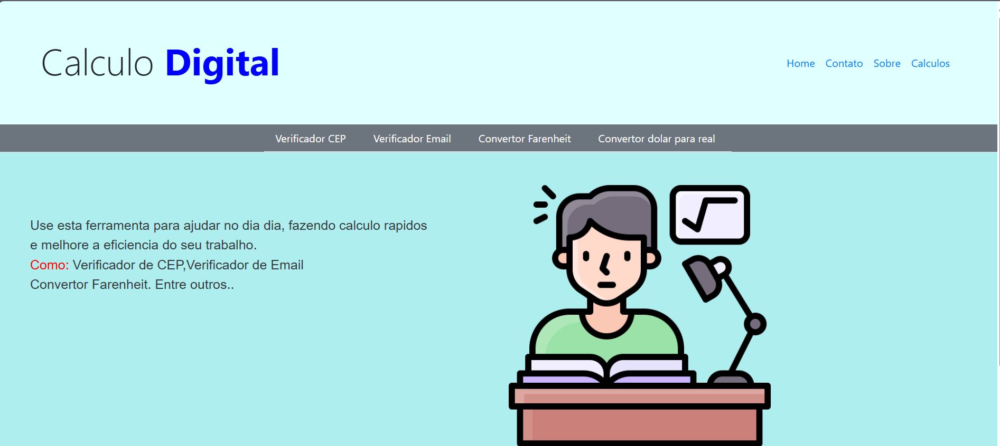

## 📂 Estrutura do Projeto

O projeto contém os seguintes arquivos e pastas:

- `convertorDolarParaReal.html` — Conversor de Dólar para Real  
- `convertorFahreinhet.html` — Conversor de Fahrenheit para Celsius  
- `verificadorEmail.html` — Validador de e-mails  
- `verificarCEP.html` — Validador de CEP  
- `index.html.html` — Página inicial do projeto  
- `logica.js` — Lógica JavaScript para as funcionalidades  
- `estilo.css` — Estilos do projeto  
- `imagens/` — Pasta com imagens usadas no projeto

  

---

## 🚀 Tecnologias Utilizadas

- HTML  
- CSS  
- JavaScript  

---

## 📌 Funcionalidades

1. **Conversor de Dólar para Real**  
   Converte valores em dólar para reais, utilizando uma taxa fixa.

2. **Conversor de Fahrenheit para Celsius**  
   Converte temperaturas em Fahrenheit para Celsius.

3. **Verificador de Email**  
   Valida se um e-mail está no formato correto.

4. **Verificador de CEP**  
   Valida um CEP e mostra uma mensagem se estiver correto ou incorreto.

---

## 📖 Como Usar

1. Clone o repositório:
```bash
git clone https://github.com/sousa44/CalculoDigital.git
